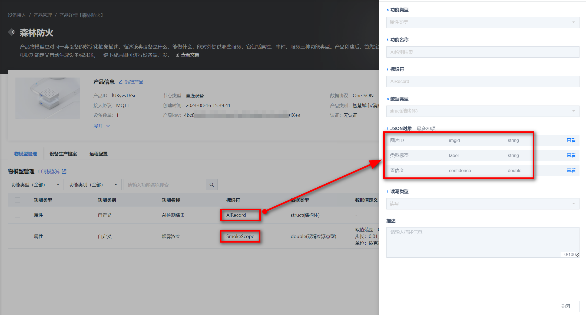
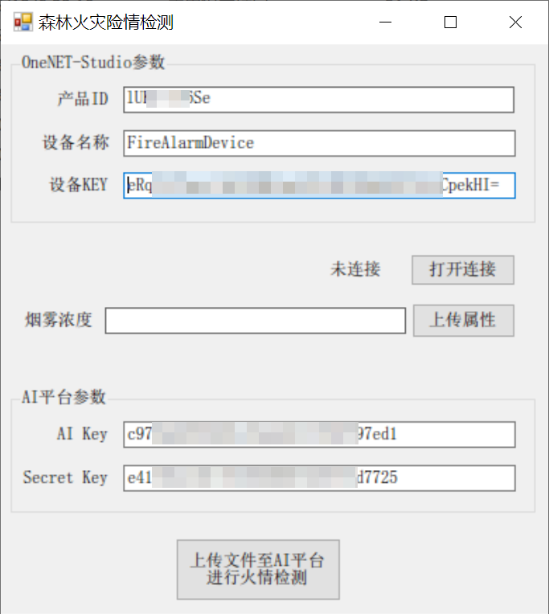

# FireAlarmSystem

这是一个使用C#编写的森林火灾检测程序。借助于OneNET平台，可以实现设备属性上传、图片上传，并能够调用OneNET AI能力，判断图片中是否存在火灾或者烟雾。

该项目运行要求：
1. VisualStudio 2022
2. OneNET Studio

## 产品与物模型

这个场景中，设备将使用MQTT协议接入到OneNET平台。

该产品的物模型截图如下，有一个double型的烟雾浓度属性，设计的目的是保存烟雾传感器的实时值；还有一个struct类型的AI检测结果属性，设计的目的是保存图片的AI识别结果。



物模型的代码可以参见 [文末](#thing_model)，可以直接导入到产品中。

## AI能力

要想使用OneNET的AI能力，首先需要开通服务，然后建立一个名为*FireDetection*的AI能力，选择火灾检测和火灾检测(GPU)，这样就可以调用API来使用火灾检测的能力了。


## 文件说明

|文件|作用|使用备注
|-|-|-|
|AiPlatform.cs|通过登录鉴权方式获取AI平台的AccessToken||
|AiResponseUtils.cs|处理AI平台返回的HTTP响应，解析里面包含的识别结果|
|FileUtils.cs|文件工具类，对文件进行各种转换
|FireAlarmForm.cs|主画面|
|OneNetResponseUtils.cs|对OneNET返回的响应进行解析
|OneNetToken.cs|生成OneNET访问Token，包括南向和北向
|OneNetMqtt.cs|使用MQTT协议连接、访问OneNET平台|

## 程序功能



在画面提供了三个功能：
1. 点击“打开连接”，使得软件连接到OneNET平台。下述操作均需要在“已连接”状态下进行。最后退出软件前，点击“关闭连接”，从OneNET平台断开。
2. 点击“上传属性”：直接输入烟雾浓度数据，上报至OneNET Studio平台
3. 点击“上传文件至AI平台进行火情检测”：上传一个文件并检测其发生火灾的可能性。该功能一共分为三个步骤：
  - 上传文件至AI平台并检测（获得识别的label标签以及其置信度）；
  - 上传文件至OneNET Studio进行备份（获得文件uuid）；
  - 上传识别结果至OneNET Studio（文件uuid、label以及置信度）。

## <span id="thing_model">附：物模型代码</span>

该代码可以直接导入新创建的HTTP直连产品中。注意其中的 *productId* 需要替换成自己的产品ID。

```
{
	"version": "1.0",
	"profile": {
		"industryId": "1",
		"sceneId": "18",
		"categoryId": "93",
		"productId": "lUKyvsT6Se"
	},
	"properties": [{
		"identifier": "AiRecord",
		"name": "AI检测结果",
		"functionType": "u",
		"accessMode": "rw",
		"desc": "",
		"dataType": {
			"type": "struct",
			"specs": [{
				"identifier": "imgid",
				"name": "图片ID",
				"dataType": {
					"type": "string",
					"specs": {
						"length": 256
					}
				}
			}, {
				"identifier": "label",
				"name": "类型标签",
				"dataType": {
					"type": "string",
					"specs": {
						"length": 256
					}
				}
			}, {
				"identifier": "confidence",
				"name": "置信度",
				"dataType": {
					"type": "double",
					"specs": {
						"min": "0",
						"max": "100",
						"unit": "百分比 / %",
						"step": "0.1"
					}
				}
			}]
		}
	}, {
		"identifier": "SmokeScope",
		"name": "烟雾浓度",
		"functionType": "u",
		"accessMode": "rw",
		"desc": "",
		"dataType": {
			"type": "double",
			"specs": {
				"min": "0",
				"max": "65535",
				"unit": "微克每立方米 / μg/m³",
				"step": "0.01"
			}
		}
	}],
	"events": [],
	"services": []
}
```
